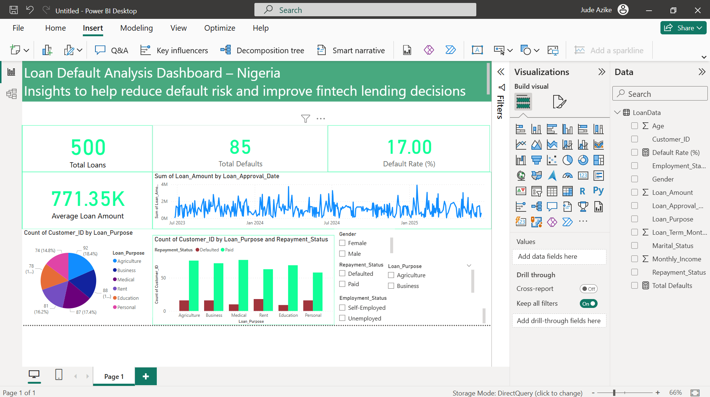
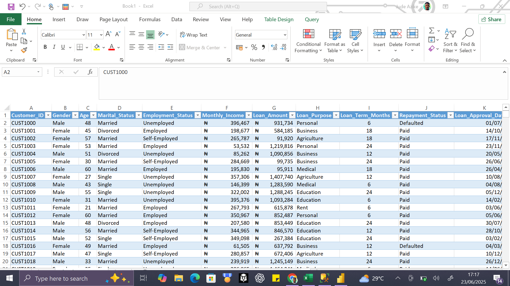
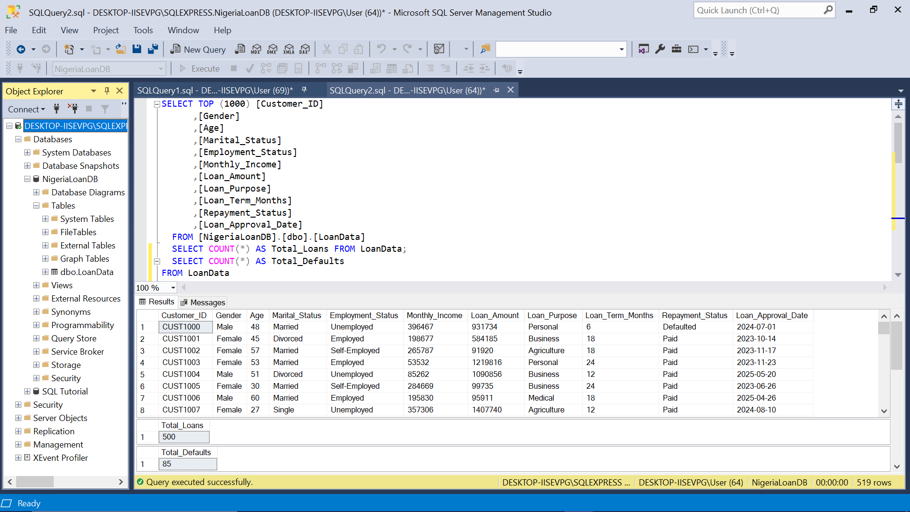
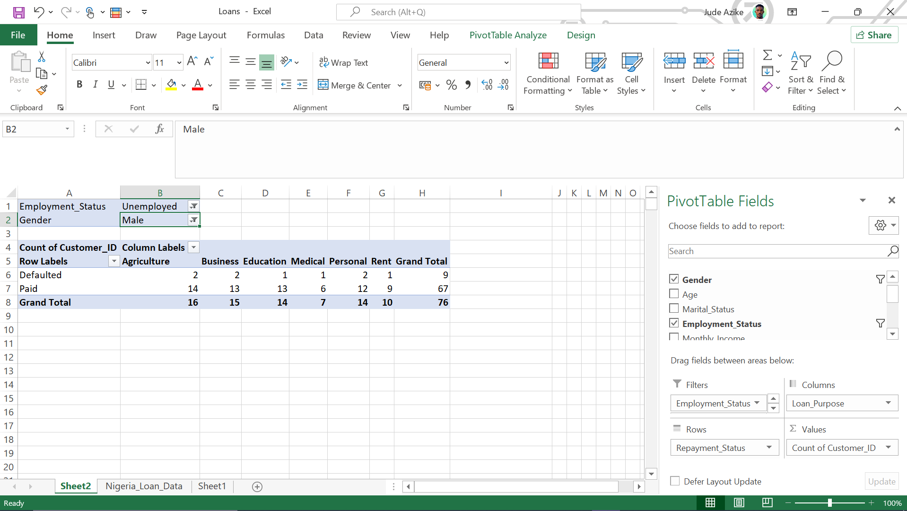

# 📊 Loan Default Analysis Dashboard – Nigeria

This project explores a fictional loan dataset to identify patterns in **loan defaults** and provide actionable insights for Nigerian fintech and microfinance institutions. It combines data analysis with interactive visualizations to support smarter lending decisions.

---

## 🧠 Project Overview

This analysis was performed using:
- **Power BI** – for data visualization and dashboard creation
- **SQL Server** – for data querying and transformation
- **Microsoft Excel** – for initial data exploration with pivot tables

---

## 💡 Key Insights

- **Overall Default Rate**: ~20% of all issued loans
- **High-Risk Loan Purposes**: Business and Agriculture loans had the highest default counts
- **Demographic Patterns**:
  - Majority of defaulters earned below ₦100,000
  - Self-employed individuals defaulted more frequently
  - Most defaults occurred in the 25–34 age group
- **Loan Trends**:
  - Disbursements peaked mid-year
  - Recent months showed increasing volumes

---

## 📁 Project Deliverables

| File | Description |
|------|-------------|
| `Loan_Default_Analysis.pbix` | Power BI dashboard file |
| `LoanData.sql` | SQL practice queries |
| `Nigeria_Loan_Data.csv` | Clean dataset used |
| `Screenshots/` | Preview images of the dashboard |
| `README.md` | This summary document |

---

## 🧰 Tools Used

- **Power BI Desktop**
- **Microsoft SQL Server**
- **SQL Server Management Studio (SSMS)**
- **Microsoft Excel**

---

## 📷 Dashboard Preview

> _Add screenshots here in your GitHub repo (e.g., dashboard full view, charts, slicers, etc.)_

## 📷 Dashboard Preview

### 📊 Power BI Dashboard Overview  

### 📈 Raw Data Exploration in Excel  

### 🧮 SQL Query Practice  

### 📋 Pivot Table Exploration  

---

## 📚 SQL Practice (20 Queries Included)

The project includes a set of SQL queries to:
- Calculate default rates by category
- Segment borrowers by income and age
- Analyze repayment status across demographics
- Track disbursement trends over time

---

## 🔍 Use Case

This dashboard equips financial analysts and fintech managers with a quick, visual breakdown of **who is defaulting**, **why**, and **how to reduce risk exposure** — especially within the Nigerian lending market.

---

## 🏷️ Tags

`#PowerBI` `#SQL` `#DataAnalysis` `#Fintech` `#Nigeria` `#Dashboard` `#LoanDefault` `#BeginnerPortfolio`

---

